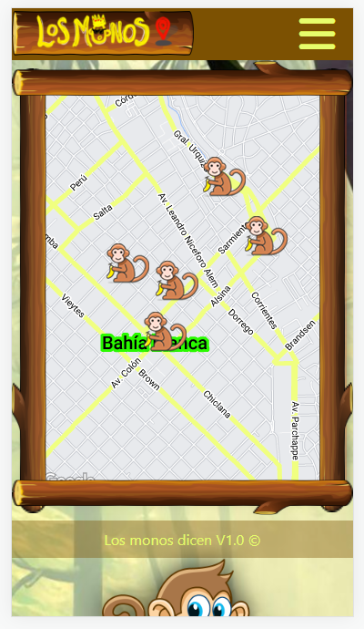
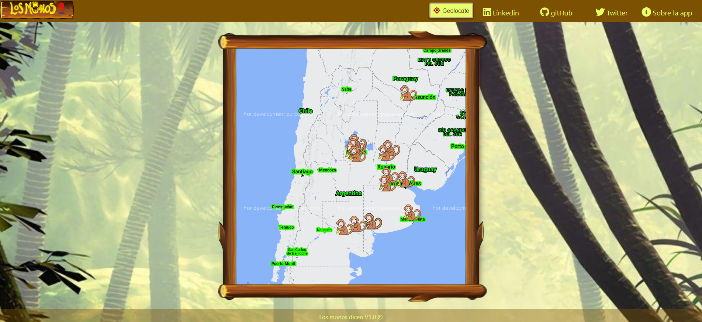

# Application to geolocate a message in the world!
We are sociable animals, our message is important in our context!  
Try this project <a target='_blank' href='https://losmonosdicen.netlify.app/'>HERE</a>
# Responsive format

	
	

# Tools used
- HTML, JS and CSS
- Google maps Api
- Firebase for storage

# Context
I like to use google tools, they are great. Learning this type of tools will allow me to scale my future projects
